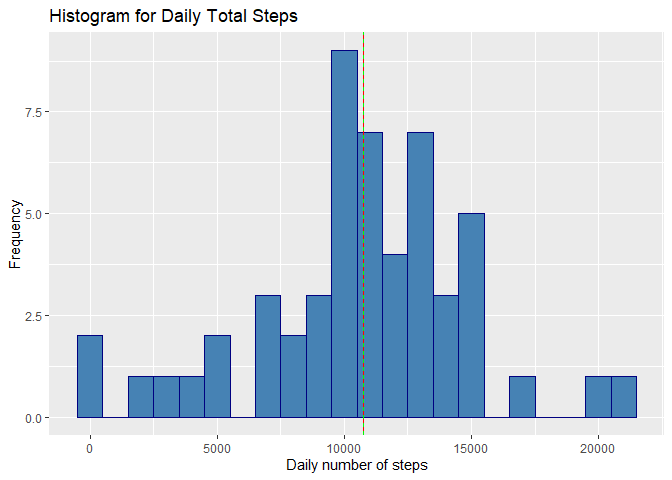
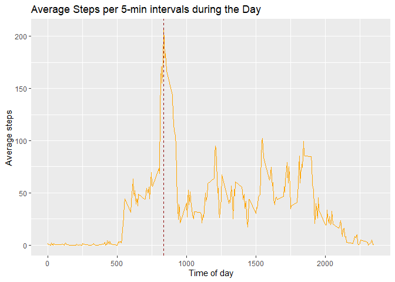
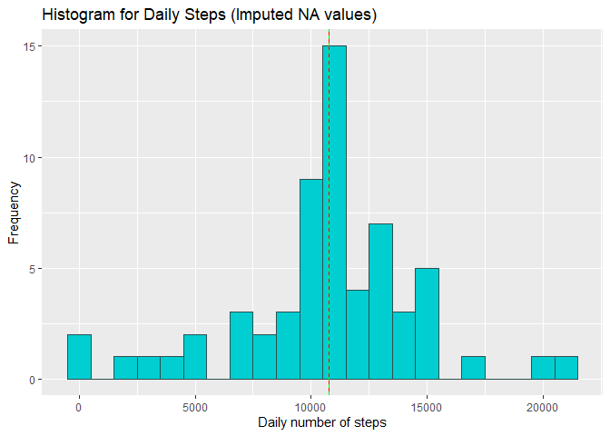
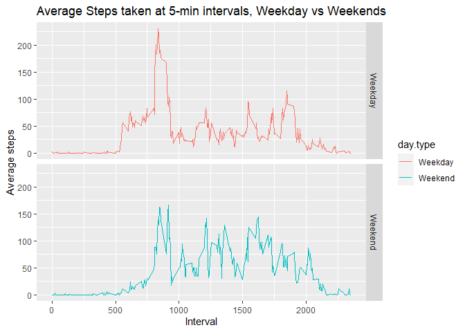

*Objective:* Perform a simple analysis on a wearable computing dataset consisting on the number of steps taken by a single person, measured in 5-minute intervals during a 2-month period between october and november 2012.  

## Loading and preprocessing the data
First of all we want to load in the packages to use for our analysis.  


```r
library(data.table)
library(dplyr)
library(ggplot2)
```

Next, unzip the file containing our data (a .csv file) and read it into R.  
We also convert the <code>date</code> variable into a proper Date type.  
**Note**: for this step make sure you are in the working directory of the project's root folder, i.e. where the activity.zip file is contained.  


```r
zipFile <- "activity.zip"
if (file.exists(zipFile)){unzip(zipFile)}
rawData <- read.csv("activity.csv")
rawData$date <- as.Date(rawData$date)
```

Once the .csv file is present in the working directory and read into a dataframe, we are ready to start our analysis.  

## What is mean total number of steps taken per day?
This question requires us to ignore missing values.   
We will produce a dataframe <code>data</code> that we can work with for this question and which doesn't have any NA values.  


```r
cleanData <- subset(rawData, !is.na(steps)) # remove NA values
data <- as_tibble(cleanData) # for pretty output purposes
head(data)
```

```
## # A tibble: 6 x 3
##   steps date       interval
##   <int> <date>        <int>
## 1     0 2012-10-02        0
## 2     0 2012-10-02        5
## 3     0 2012-10-02       10
## 4     0 2012-10-02       15
## 5     0 2012-10-02       20
## 6     0 2012-10-02       25
```

**Prepare the Data for the plot:**
We want to know the total number of steps taken each day. For this, we perform chaining on the <code>data</code> dataframe to produce a new, summarized data frame <code>daily.steps</code> that contains maps a given date to the total number of steps.  


```r
daily.steps <- data %>%
  group_by(date) %>%
  summarise(daily_steps = sum(steps), .groups="keep")

head(daily.steps)
```

```
## # A tibble: 6 x 2
## # Groups:   date [6]
##   date       daily_steps
##   <date>           <int>
## 1 2012-10-02         126
## 2 2012-10-03       11352
## 3 2012-10-04       12116
## 4 2012-10-05       13294
## 5 2012-10-06       15420
## 6 2012-10-07       11015
```

We are also asked to calculate the mean and the median across all dates, which can be simply done with <code>mean</code> and <code>median</code> functions (I am storing them in variables so we can use them for our histogram up next).  


```r
stepsmean <- mean(daily.steps$daily_steps)
stepsmedian <- median(daily.steps$daily_steps)

print(paste("Mean=",stepsmean))
```

```
## [1] "Mean= 10766.1886792453"
```

```r
print(paste("Median=",stepsmedian))
```

```
## [1] "Median= 10765"
```
We can see that both measurements are almost identical for this data.  

#### Plot 1. Histogram for Daily Steps.

We use the previous <code>daily.steps</code> dataframe to produce a histogram by setting the <code>daily_steps</code> variable along the x-axis, and we choose a binwidth of 1000 units. We also show where the median (green dashed line) and mean (red solid line) stand in this histogram.  


```r
plot.dailysteps <- ggplot(daily.steps, aes(x=daily_steps)) + 
  geom_histogram(binwidth=1000, fill="steelblue", color="navyblue") +
  labs(title="Histogram for Daily Total Steps",
       x="Daily number of steps", y="Frequency") +
  geom_vline(xintercept=stepsmean,
             color="red") +
  geom_vline(xintercept = stepsmedian,
             linetype="dashed",
             color="green")

plot.dailysteps
```

<!-- -->


## What is the average daily activity pattern?

This time we are asked to produce a time series plot that shows the average steps taken at each one of the 5-min intervals along the day.  

**Prepare the Data for the plot:**
We reuse the <code>data</code> dataframe that is free from missing values to produce a new, summarized dataframe that contains the mean steps taken according to the <code>interval</code> id and that we can later use for our plot.  
Just for readability, we also add an extra column <code>interval_f</code> that indicates the starting time that the <code>interval</code> id belongs to.  


```r
interval.steps <- data %>%
  group_by(interval) %>%
  summarise(avg_steps = mean(steps), .groups="keep") %>%
  mutate(interval_f = sprintf("%04d", interval)) %>%
  mutate(interval_f = paste(substring(interval_f, 1, 2), substring(interval_f, 3, 4), sep=":"))

head(interval.steps)
```

```
## # A tibble: 6 x 3
## # Groups:   interval [6]
##   interval avg_steps interval_f
##      <int>     <dbl> <chr>     
## 1        0    1.72   00:00     
## 2        5    0.340  00:05     
## 3       10    0.132  00:10     
## 4       15    0.151  00:15     
## 5       20    0.0755 00:20     
## 6       25    2.09   00:25
```
Which 5-minute interval, on average across all the days in the dataset, contains the maximum number of steps? We can find the row corresponding to the maximum average measurement like this: 


```r
maxSteps = max(interval.steps$avg_steps)
interval.maxsteps = interval.steps[which(interval.steps$avg_steps == maxSteps),]

print(paste("The maximum average number of steps is ", maxSteps, "  taken at", interval.maxsteps$interval_f, " in the morning."))
```

```
## [1] "The maximum average number of steps is  206.169811320755   taken at 08:35  in the morning."
```
A possible explanation is that this person walks the most at 8:035 in the morning because of commuting to work or school.  

#### Plot 2. Time series for average steps along the day.


```r
plot.intervalsteps <- ggplot(interval.steps, aes(x=interval, y=avg_steps)) + 
                      geom_line(color="orange") +
                      labs(title="Average Steps per 5-min intervals during the Day",
                           x="Time of day", y="Average steps") +
                      geom_vline(xintercept = interval.maxsteps$interval, color="darkred",
                                 linetype="dashed")
plot.intervalsteps
```

<!-- -->

From our plot it looks like most of the walking happens between 8:00 and 9:00, possibly due to commuting.  

## Imputing missing values
Our analysis up to now has been made ignoring the missing values of the original dataset. Since ignoring missing values may induce bias, it may also be important to view patterns with imputed data.  
First let us verify how many NA values we have:  

```r
numberofNA <- sum(is.na(rawData$steps))
print(paste("Total number of rows with missing values is", numberofNA))
```

```
## [1] "Total number of rows with missing values is 2304"
```

**Strategy: use the interval's average steps to impute missing values in the rows.**  

- We can reuse our <code>interval.steps</code> dataframe. If we join this dataframe with the original dataset by the <code>interval</code> id, we can know the interval's average value for every row.
- For the missing value rows, we replace the <code>steps</code> value with the average.  


```r
naRows <- which(is.na(rawData$steps))
imputedData <- full_join(rawData, interval.steps, by="interval")
imputedData[naRows,1] <- imputedData[naRows,4]

head(imputedData[naRows, ])
```

```
##       steps       date interval avg_steps interval_f
## 1 1.7169811 2012-10-01        0 1.7169811      00:00
## 2 0.3396226 2012-10-01        5 0.3396226      00:05
## 3 0.1320755 2012-10-01       10 0.1320755      00:10
## 4 0.1509434 2012-10-01       15 0.1509434      00:15
## 5 0.0754717 2012-10-01       20 0.0754717      00:20
## 6 2.0943396 2012-10-01       25 2.0943396      00:25
```
We can confirm that the previously NA rows now contain the value of the average steps of that interval.  

**Prepare the Data for the plot:**
Use the newly imputed dataframe to produce a summarized <code>imp.daily.steps</code> dataframe that contains the daily steps taken for each date.


```r
imp.daily.steps <- imputedData %>%
  group_by(date) %>%
  summarise(daily_steps = sum(steps), .groups="keep")

head(imp.daily.steps)
```

```
## # A tibble: 6 x 2
## # Groups:   date [6]
##   date       daily_steps
##   <date>           <dbl>
## 1 2012-10-01      10766.
## 2 2012-10-02        126 
## 3 2012-10-03      11352 
## 4 2012-10-04      12116 
## 5 2012-10-05      13294 
## 6 2012-10-06      15420
```
Here we can see that the first date (2012-10-01) has now an imputed value of daily steps equivalent to the mean, as it was one of the few dates that had completely missing values.  
Next, as we did in for the first histogram, we can recalculate the mean and median of the data easily.  


```r
imp_mean <- mean(imp.daily.steps$daily_steps)
imp_median <- median(imp.daily.steps$daily_steps)

print(paste("Mean =",imp_mean))
```

```
## [1] "Mean = 10766.1886792453"
```

```r
print(paste("Median =",imp_median))
```

```
## [1] "Median = 10766.1886792453"
```
The median and mean values don't differ much from the non-imputed case, but this time the median is exactly equivalent to the mean, probably because we now have more occurrences of 10766.18 across the population. Indeed, this will be shown in the histogram.

#### Plot 3. Histogram of Daily Steps with Imputed Data.

```r
plot.impdailysteps <- ggplot(imp.daily.steps, aes(x=daily_steps)) + 
  geom_histogram(binwidth=1000, fill="darkturquoise", color="darkslategray") +
  labs(title="Histogram for Daily Steps (Imputed NA values)",
       x="Daily number of steps", y="Frequency") +
  geom_vline(xintercept=imp_mean,
             color="red") +
  geom_vline(xintercept = imp_median,
             linetype="dashed",
             color="green")

plot.impdailysteps
```

<!-- -->

## Are there differences in activity patterns between weekdays and weekends?

For this question we are required to reutilize the <code>imputedData</code> dataframe.  
We can derive a new dataframe <code>dayData</code> which has an additional categorical variable, <code>day.type</code> indicating whether the date of measurement is a weekday or a weekend.
Based on <code>day.type</code> we will be able to separate the data into two separate time series plots and compare the patterns.  


```r
dayData <- mutate(imputedData, day.type = fifelse(weekdays(imputedData$date)%in%c("Saturday", "Sunday"), "Weekend", "Weekday"))
dayData <- dayData[, -c(4,5)]

head(dayData)
```

```
##       steps       date interval day.type
## 1 1.7169811 2012-10-01        0  Weekday
## 2 0.3396226 2012-10-01        5  Weekday
## 3 0.1320755 2012-10-01       10  Weekday
## 4 0.1509434 2012-10-01       15  Weekday
## 5 0.0754717 2012-10-01       20  Weekday
## 6 2.0943396 2012-10-01       25  Weekday
```

Notice how we got rid of the <code>avg_steps</code> and <code>interval_f</code> columns at 4 and 5 because we no longer need them and we will be recalculating a new average that takes the weekday into account.

**Prepare the Data for the plot:**

Once again we perform chaining to produce a summarized dataframe that we can use for our plot, which contains the average steps taken per unique combination of interval id and day type. 


```r
day.interval.steps <- dayData %>%
  group_by(interval, day.type) %>%
  summarise(avg_steps = mean(steps), .groups="keep")

head(day.interval.steps)
```

```
## # A tibble: 6 x 3
## # Groups:   interval, day.type [6]
##   interval day.type avg_steps
##      <int> <chr>        <dbl>
## 1        0 Weekday     2.25  
## 2        0 Weekend     0.215 
## 3        5 Weekday     0.445 
## 4        5 Weekend     0.0425
## 5       10 Weekday     0.173 
## 6       10 Weekend     0.0165
```

#### Plot 4. Patterns in activity of Weekdays vs Weekends


```r
plot.weekdaysteps <- ggplot(day.interval.steps, aes(x=interval, y=avg_steps)) +
  geom_line(aes(color=day.type)) +
  facet_grid(day.type~.) +
  labs(title="Average Steps taken at 5-min intervals, Weekday vs Weekends", x="Interval", 
       y="Average steps")

plot.weekdaysteps
```

<!-- -->

From the plot we can see that on weekdays there is a much higher amount of walking in the morning, which supports our theory of the spike caused by commuting (assuming commuting only happens on weekdays as it usually does).  This is followed by a period of much less walking possibly due to sitting in the office most of the time.

On the other hand, we have a relatively more uniform amount of steps during the day on weekends, which can be explained due to possible weekend activities and leisure throughout the day.
